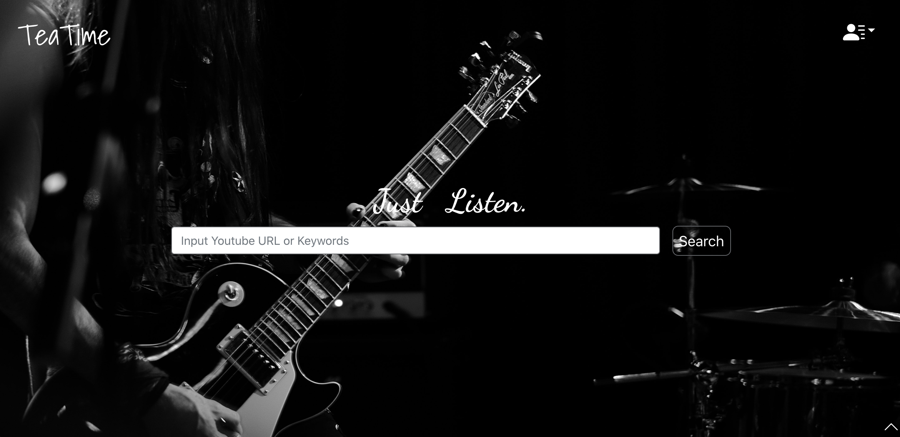
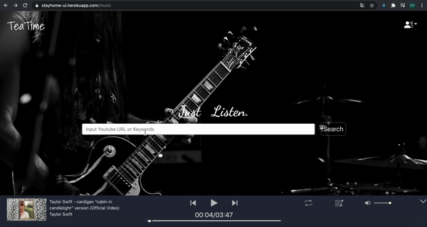
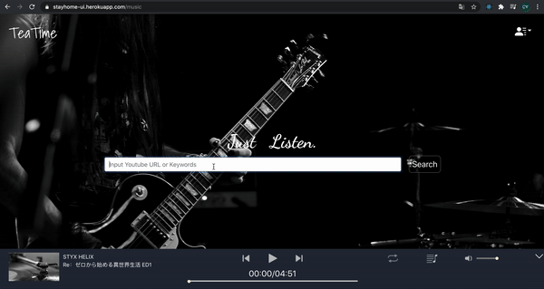
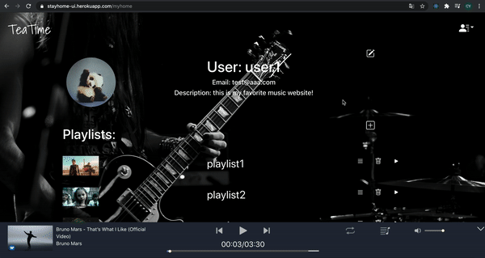
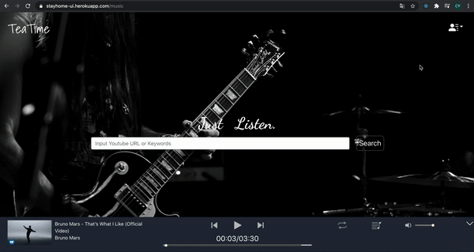
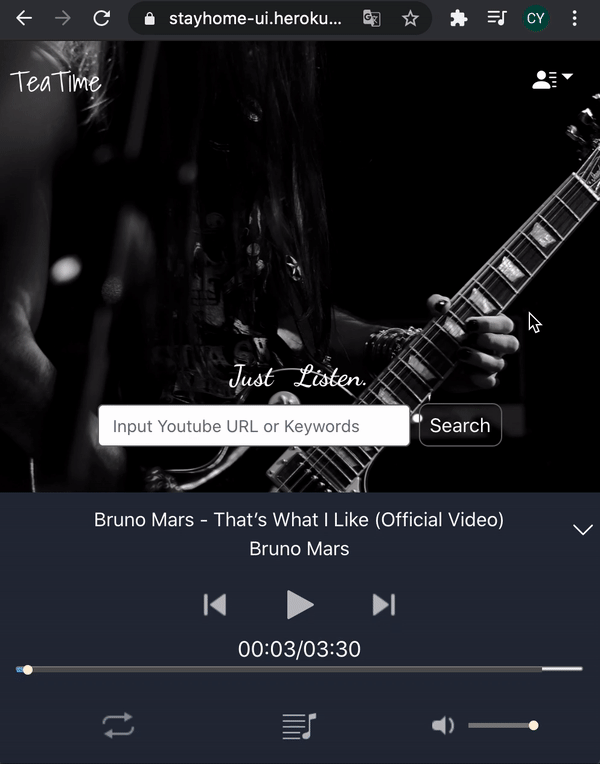

# TeaTime Music:

TeaTime music is a website that helps you get audio from youtube videos. Like any music stream service, you can search music, stream your favorite songs and create playlists for your favorites.

Visit live application on heroku: 
https://stayhome-ui.herokuapp.com/music

## Register
To register an account, users should input email(unique), username and password, the email should be in correct format like `example@aaa.com`, username should contain 2-8 characters and the password should be longer than 8 characters. Otherwise, you will receive an alert. **The website is protected by reCAPTCHA to prevent robot.**

## Login
To login an account, users should input correct email and password. After that, the login status can be kept in **48 hours**

## Search music
To search a song, you can input keyword on the search bar, or input **valid youtube url** .
* If you choose search with keyword, you will get the video search result from youtube, you can click each result to see detail, and choose to save to your playlist (**login required**) or play now(add to current **temporary list**)

* If you put a valid youtube link (live/movie format is not support currently), you will get the detail page for this video. You can play it or save it as described above.

## MyHome
Myhome is available if you login. You can:
* Edit your personal information 

* Create a new playlist (should have unique name)
* Delete a playlist
* Play whole playlist
* Edit your playlist 

* Delete a music from a playlist

## Music player
* We provide responsive design for music player, you can also toggle the player for small screen.

  

* There are 3 playback mode for this player: none(stop when current song end), playlist-repeat, shuffle-repeat. Click the mode button switch from one mode to another.

  none            | playlist-reapt          |  shuffle
  :-----:|:-------:|:-------------:|
   | |  

* You can click song in playlist to play selected song, note that the playlist in player **is always temporary**