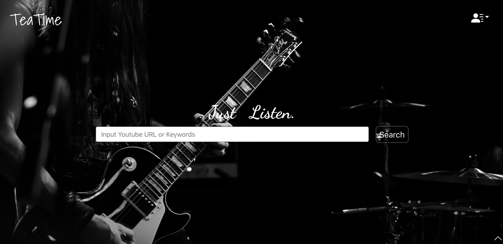

# Teatime_Music_API


This is the API code for the website project **Teatime music**

TeaTime music is a website that helps you get audio from youtube videos. Like any music stream service, you can search music, stream your favorite songs and create playlists for your favorites.

Visit live application on heroku:<br>
https://stayhome-ui.herokuapp.com/music

For Front-end code, visit:<br>
https://github.com/Dalanke/youtube_audio_UI

## Contribution

[Dalanke](https://github.com/Dalanke)<br>
[kakatcy](https://github.com/kakatcy)<br>


## User guide for website
A brief introduction of website feature:<br>
[User guide](./Intro.md)

## Usage
### Environment variable setting
Creat `.env` file and sets a variable per line for local testing:
```bash
# cloud MongoDB url
DB_URL=<your mongoDB url>
# ReCAPTCHA 2.0
RECAPTCHA_KEY=<your ReCAPCHA key>
# port default to 777
PORT=<assigned api server port>
```

### Run in localhost
* Clone API repo and install dependency, configure `.env` file:
  ```
  npm install
  npm start
  ```
* Clone [UI repo](https://github.com/Dalanke/youtube_audio_UI) and install dependency, configure `.env` file
  ```
  npm install

  # comment out if test in localhost
  REACT_APP_API_ENDPOINT=https://stayhome-api.herokuapp.com/graphql

  npm start
  ```
The streaming service might not be reliable due to the restriction of heroku, we recommend test on localhost to get better experience.
